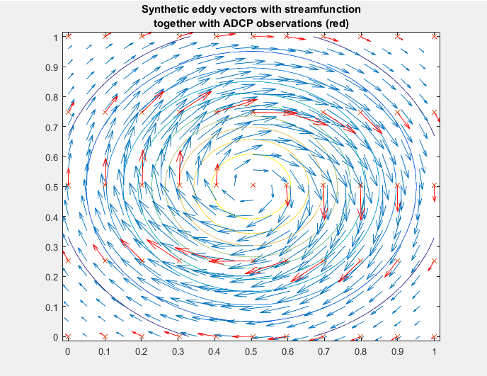
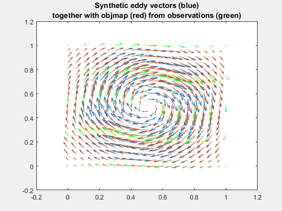
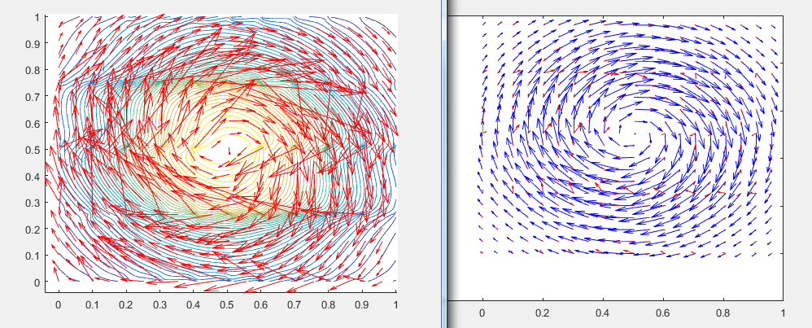
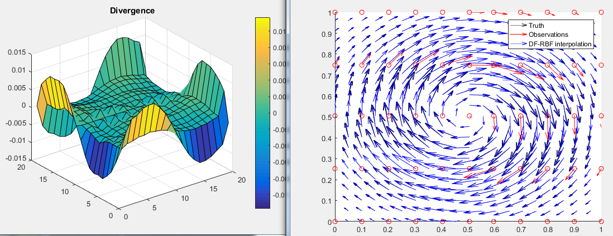

# Vector field interpolation

A short tutorial that compares 3 different methods of interpolating current fields from scattered or transect observations (VM-ADCPS, gliders or the like).

# Generate synthetic eddy test scenario

```Matlab
%% Generate synthetic eddy data
% following Vennell and beatson JGR 2009
% Eddy field
x=linspace(0,1,100);
y=linspace(0,1,100)';
[xG,yG]=meshgrid(x,y);
x0=0.5; y0=0.5;
r = sqrt((xG-x0).^2 + (yG-y0).^2);
r0=0.25;
% a gaussian stream function
g1 = -(2.*((xG-x0)./x0).^2);
g2 = -(2.*((yG-y0)./y0).^2);
G = (x0^2 + y0^2).*exp(g1 + g2);
[Gx,Gy] = gradient(G,x,y);
% Eddy velocity components
u = -Gy; v=Gx;

%PLOT VECTORS... full field and subsampled observations

figure(1)
clf
contour(xG,yG,G,10)
hold on
iplot=[1:5:length(xG)]; % plot some... not all
h1=quiver(xG(iplot,iplot),yG(iplot,iplot),u(iplot,iplot),v(iplot,iplot),0)
title({'Synthetic eddy vectors with streamfunction';'together with ADCP observations (red)'}) 
% sample through.. with a set VMADCP track
dx = 0.1; indx = round(interp1(x,[1:length(x)],[min(x):dx:max(x)]));
dy = 0.25; indy = round(interp1(y,[1:length(y)],[min(y):dy:max(y)]));
xobs = xG(indy,indx); xobs=xobs(:);
yobs = yG(indy,indx); yobs=yobs(:);
uobs = u(indy,indx); uobs=uobs(:);
vobs = v(indy,indx);vobs=vobs(:);

plot(xobs,yobs,'x')
h2=quiver(xobs,yobs,uobs,vobs,0,'r')

% same scale the quivers 
q=0.1;
set(h1,'UData',q*get(h1,'UData'),'VData',q*get(h1,'VData'))
set(h2,'UData',q*get(h2,'UData'),'VData',q*get(h2,'VData'))
```




# Objective analysis / mapping

```Matlab
%%% optim interp
[uobj,uobj_err]=objmap(xobs,yobs,uobs,xG,yG,[.1 .1],0.05);
[vobj,vobj_err]=objmap(xobs,yobs,vobs,xG,yG,[.1 .1],0.05);

figure
h1=quiver(xG(iplot,iplot),yG(iplot,iplot),u(iplot,iplot),v(iplot,iplot),0)
hold on
h2=quiver(xG(iplot,iplot),yG(iplot,iplot),uobj(iplot,iplot),vobj(iplot,iplot),0)
h3=quiver(xobs,yobs,uobs,vobs,0,'g')
q=0.1;
set(h1,'UData',q*get(h1,'UData'),'VData',q*get(h1,'VData'))
set(h2,'UData',q*get(h2,'UData'),'VData',q*get(h2,'VData'))
set(h3,'UData',q*get(h3,'UData'),'VData',q*get(h3,'VData'))
title({'Synthetic eddy vectors (blue)';'together with objmap (red) from observations (green)'}) 
```




# Streamfunction interpolation following Freeland and Goud


```Matlab
%%  Freeland&Gould method

% setting the similarity radius to R km
R0=.8 ;
b=1.618033 / R0 ;

for i1=1:size(xG,1)
    for i2=1:size(xG,2)
        
        % distance to observations
        r= sqrt((xG(i1,i2)-xobs).^2 + (yG(i1,i2)-yobs).^2);
        % angle to observations
        % angle_to_others=azimuth(ones(size(xobs)).*yG(i1,i2),ones(size(xobs)).*xG(i1,i2),yobs,xobs)

clear az
for idx=1:numel(xobs)
        dx=xobs(idx)-xG(i1,i2);
        dy=yobs(idx)-yG(i1,i2);
        if dx==0 & dy==0;  az(idx)=0   ;end
        if dx>=0 & dy>=0;  az(idx)=atand(dx/dy)   ;end
        if dx<=0 & dy>=0;  az(idx)=360-atand(abs(dx)/dy)   ;end
        if dx>=0 & dy<=0;  az(idx)=90+atand(abs(dy)/dx)   ;end
        if dx<=0 & dy<=0;  az(idx)=180+atand(abs(dx)/abs(dy))   ;end                
end
az(isnan(az))=0;
angle_to_others=az';

              
  for i_others=1:numel(r)
    theta = (angle_to_others(i_others));
R = [cosd(theta) -sind(theta); sind(theta) cosd(theta)];
rotated_current=[vobs(i_others),uobs(i_others)]*R();
longitudinal(i_others)=(rotated_current(1));
transversal(i_others)=(rotated_current(2));
  end   
  

fr=( 1+ b*r ) .* exp(-b*r );
gr=( 1+ b*r - b.^2*r.^2  ) .* exp(-b*r );
 
g0(i1,i2)= sum(fr'.*longitudinal) + sum(gr'.*transversal)  ;
       
    end
end

 [vi,ui] = gradient(g0);
ui=-(ui-mean(ui(:))) / (max(ui(:))-min(ui(:)))
vi=-(vi-mean(vi(:))) / (max(vi(:))-min(vi(:)))

  vi=-vi;

figure(3)
clf
hold on
contour(xG,yG,g0,50)
quiver(xG(iplot,iplot),yG(iplot,iplot),ui(iplot,iplot),vi(iplot,iplot),0,'r')

figure(2)
clf
h1=quiver(xG(iplot,iplot),yG(iplot,iplot),u(iplot,iplot),v(iplot,iplot),0,'b')
hold on
h2=quiver(xG(iplot,iplot),yG(iplot,iplot),ui(iplot,iplot),vi(iplot,iplot),0,'r')
q=0.1;
set(h1,'UData',q*get(h1,'UData'),'VData',q*get(h1,'VData'))
set(h2,'UData',q*get(h2,'UData'),'VData',q*get(h2,'VData'))

```



# Divergence free radial basis functions

```Matlab
%% Div free radial basis functions


% determine centers
x_obs=xobs;
y_obs=yobs;
u_obs=uobs;
v_obs=vobs;

% n_centers=100;
% 
% ixr=randi(numel(x_obs),[n_centers,1]);
% x_c=x_obs(ixr);
% y_c=y_obs(ixr);
% u_c=u_obs(ixr);
% v_c=v_obs(ixr);

x_c=x_obs;
y_c=y_obs;
u_c=u_obs;
v_c=v_obs;

figure(2)
clf
hold on
quiver(x,y,u,v,'k')
 quiver(x_obs,y_obs,u_obs,v_obs,'r')
plot(x_c,y_c,'or')

%% train RBFs

clear data
data=[u_obs,v_obs]';
data=data(:);

% determine radiuses/differences
clear r rbf

dataindex=1;
for i=1:size(x_obs,1)
    
        %distance to centers
        r=sqrt( (x_obs(i)-x_c).^2 + (y_obs(i)-y_c).^2 )';
        logr=log(r);
        logr(r==0)=0;
             
        % u part
   rbf(dataindex,:)  =   [ 1,0,x_obs(i),y_obs(i),0 , [r.^2.*(12*logr+7) , zeros(size(r))]  + [ -(8*logr+6) .* (x_obs(i)-x_c)' .* (x_obs(i)-x_c)' ,  -(8*logr+6) .* (x_obs(i)-x_c)' .* (y_obs(i)-y_c)'   ]  ] ;
        %v part
   rbf(dataindex+1,:)= [0,1,-y_obs(i),0,x_obs(i) , [zeros(size(r)), r.^2.*(12*logr+7)]   + [ -(8*logr+6) .* (y_obs(i)-y_c)' .* (x_obs(i)-x_c)' ,  -(8*logr+6) .* (y_obs(i)-y_c)' .* (y_obs(i)-y_c)'   ]  ] ;
    dataindex=dataindex+2    
end


params=data'/rbf'  ;%use mrdivide to solve system of equations. For large systems it may 


%% evaluate rbfs

% [xgrid,ygrid]=meshgrid(linspace(0,1,20),linspace(0,1,20));

xgrid=xG(iplot,iplot);
ygrid=yG(iplot,iplot);
    
xgridv=xgrid(:);
ygridv=ygrid(:);

clear r rbf
dataindex=1;
for i=1:size(xgridv,1)
    
        r=sqrt( (xgridv(i)-x_c).^2 + (ygridv(i)-y_c).^2 )';
        logr=log(r);
        logr(r==0)=0;
            % u part
   rbf(dataindex,:)  =   [ 1,0,xgridv(i),ygridv(i),0 , [r.^2.*(12*logr+7) , zeros(size(r))]  + [ -(8*logr+6) .* (xgridv(i)-x_c)' .* (xgridv(i)-x_c)' ,  -(8*logr+6) .* (xgridv(i)-x_c)' .* (ygridv(i)-y_c)'   ]  ] ;
        %v part
   rbf(dataindex+1,:)= [0,1,-ygridv(i),0,xgridv(i) , [zeros(size(r)), r.^2.*(12*logr+7)]   + [ -(8*logr+6) .* (ygridv(i)-y_c)' .* (xgridv(i)-x_c)' ,  -(8*logr+6) .* (ygridv(i)-y_c)' .* (ygridv(i)-y_c)'   ]  ] ;
    dataindex=dataindex+2   ;
end

estimate=params*rbf';%apply weights
estimate=reshape(estimate,[2,size(xgridv,1)]);
ugrid=reshape( estimate(1,:) , size(xgrid) );
vgrid=reshape( estimate(2,:) , size(xgrid) );

% a=[1,1,1;2,2,2]
% a=a(:)
% reshape(a,[2,3])

figure(2)
clf
hold on
% quiver(x,y,u,v,'k')
 quiver(x_obs,y_obs,u_obs,v_obs,'r')
plot(x_c,y_c,'or')
quiver(xgrid,ygrid,ugrid,vgrid,'k')

figure(3)
clf
div=divergence(ugrid,vgrid);
surf(div)
title('Divergence')
colorbar

figure(4)
clf
hold on
h1=quiver(xG(iplot,iplot),yG(iplot,iplot),u(iplot,iplot),v(iplot,iplot),0,'k')
h2= quiver(x_obs,y_obs,u_obs,v_obs,0,'r')
h3=quiver(xgrid,ygrid,ugrid,vgrid,0,'b')
legend('Truth','Observations','DF-RBF interpolation')
q=0.1;
set(h1,'UData',q*get(h1,'UData'),'VData',q*get(h1,'VData'))
set(h2,'UData',q*get(h2,'UData'),'VData',q*get(h2,'VData'))
set(h3,'UData',q*get(h3,'UData'),'VData',q*get(h3,'VData'))
xlim([0,1])
ylim([0,1])
```



